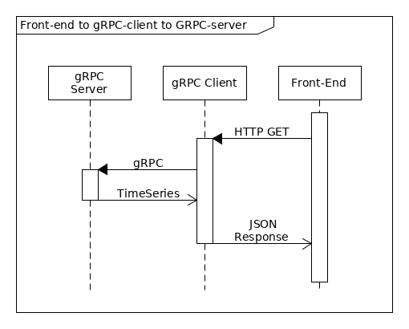

# gRPC-microservice
Language-independent gRPC-based microservice

## Design
The central tenet of gRPC is the remote proxy pattern described below.

The protobuf proto/server.proto file provides the service definition and payload structure, in a language agnostic interface definition language. After specifying the service definition the necessary Classes are generated by `
python -m grpc.tools.protoc  --python_out=. --grpc_python_out=. --proto_path=. server.proto`. My Server in Server.py implements the ServerServicer generated class, and the Client instantiates a Stub which allows remote access to the server methods over a specific channel.

The diagram below describes the overall structure of the application:

The gRPC client also functions as a tornado HTTP server.
Actually in my implementation the HTTP GET renders a UI, simply a button currently but could be extended to allow querying of specific times within the time-series data. 
Pressing the 'request data' button sends a HTTP POST request to the HTTP server which in turn sends a proto request to the gRPC server. 
The client then renders the returned stream of readings (time series) into a JSON string response using a JSONEncoder. 
## Testing
There are a basic suite of tests in Server/Tests.py. They are far from exhaustive and aim to test the overall functionality. As this task was primarily about investigating new technologies than implementing lots of functionality, I took a less TDD/unit testing approach than usual.

## Running
Clone repository and run `$docker build <path>/gRPC-microservice` then `$docker run -p 8888:8888 <imagename>` and go to `localhost:8888`. This runs Client and Server in  the same container. I have created `Dockerfile`s to allow seperate Server and Client containers, but I would need to progress beyond localhost to get these to communicate. 