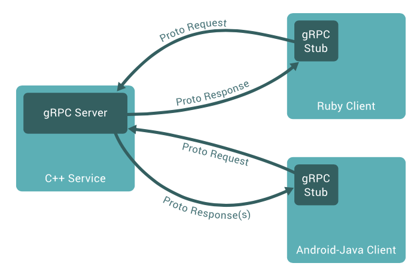

# gRPC-microservice
Language-independent gRPC-based microservice

## Design

## Testing
There are a basic suite of tests in Server/Tests.py. They are far from exhaustive and aim to test the overall functionality. As this task for me was primarily about investigating new technologies than implementing lots of functionality, I  took a less TDD/unit testing approach than usual.

## Running
Clone repository and run `$docker build <path>/gRPC-microservice` then `$docker run -p 8888:8888 <imagename>` and go to `localhost:8888`. This runs Client and Server in  the same container. I have created `Dockerfile`s to allow seperate Server and Client containers, but I would need to progress beyond localhost to get these to communicate. 